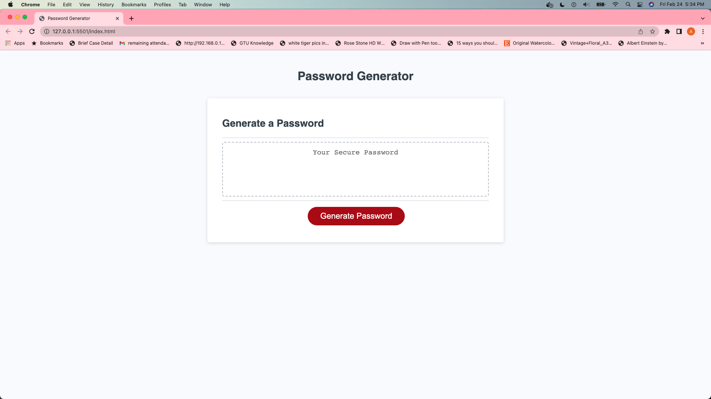
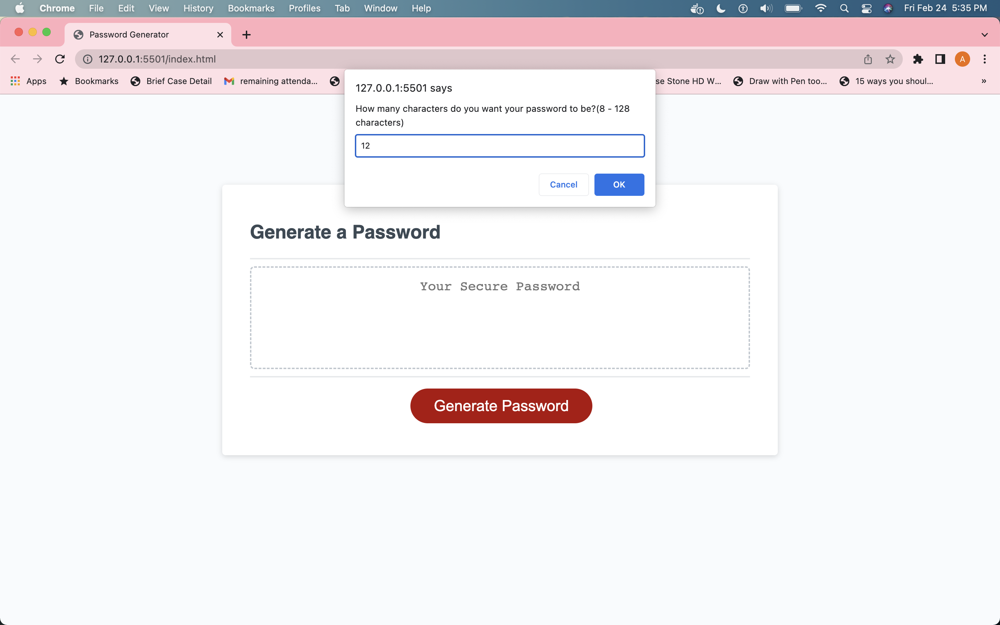
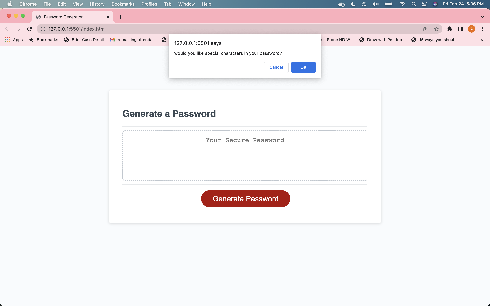
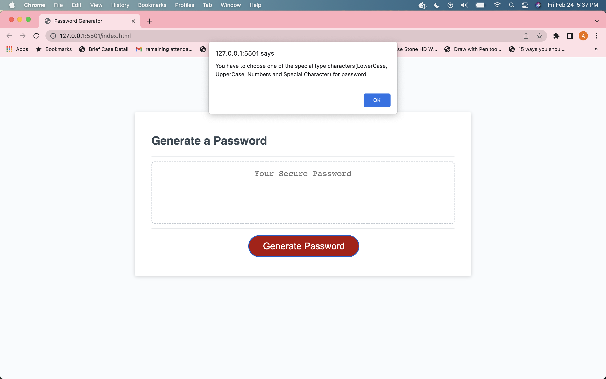
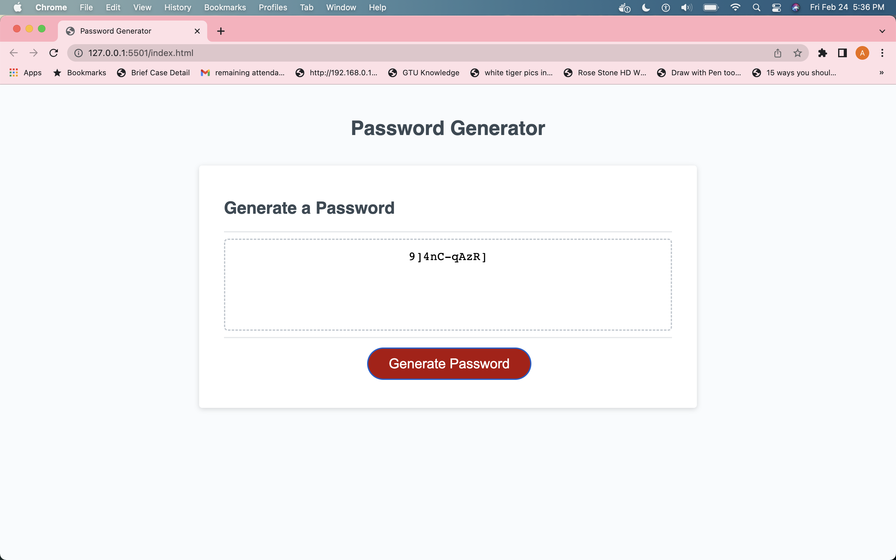

# Password_Generator
Generate strong and greater security password

## Description

Password Generator application enables employees to generate random passwords based on criteria that they’ve selected.so it generates strong password for greater security. This app will run in the browser and will feature dynamically updated HTML and CSS powered by JavaScript code. It will have a clean and polished, responsive user interface that adapts to multiple screen sizes.

In this when you click Generate Password button then first prompt willl open and ask you to enter your choice it must be between 8 to 128 numbers only.because we set password length between 8 to 128.so if you enter below 8 and greater 128 digit , any string value and dont pass any value then alert message will appear like "Character Length has to be a number, 8-128 digits, Please try again."

if you pass valid number between 8 to 128 then it displays 4 messages using confirm method to choice one of the special character like
    1) "would you like lowercase letters in your password?"
    2) "would you like Uppercase letters in your password?"
    3) "would you like special characters in your password?"
    4) "would you like numbers in your password?"

you can select all of this choice or any combination of them or any one of them but if you cancle all of this four choice then one meassage will appear like
    1) "You have to choose one of the special type characters(LowerCase, UpperCase, Numbers and Special Character) for password"

so if all validation will true then password will display on page otherwise you have to choice again.

## Installation

N/A

## Usage 

Password Generator Deployed website link - 

Here you can see screenshots of Password Generator website.

## Credits

N/A

## License

please refer to the License in the repo.